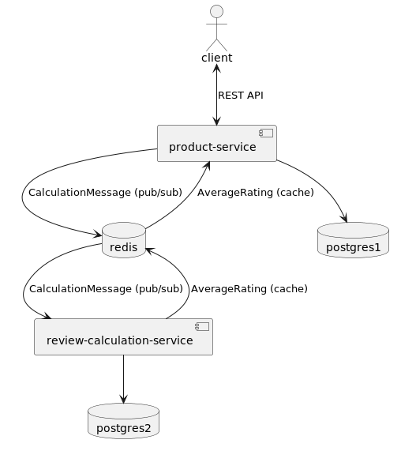
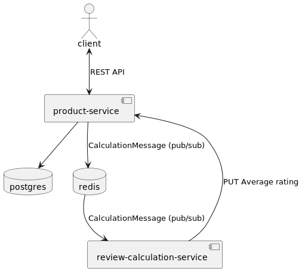

I considered this architecture:

But than found a way where I could eliminate one database and improve "caching" of average ratings:

Reasoning/explanation:
- All data are stored in single database, so that it is easier to join them
- Redis here is used as MQ (pub/sub mode) to send review calculation messages from product-service to review-calculation-service
- For average rating calculation, there is no need to have all the review present. These fields of CalculationMessage are enough:
   - averageRating;
   - originalCount;
   - countChange;
   - ratingChange;
- Final average rating is:

      newAverageRating = (averageRating * originalCount + ratingChange) / (originalCount + countChange)  

- review-calculation-service informs product service about new average rating via private REST endpoint
- Average rating is stored in products table
- I know there was this sentence "Product reviews and average product ratings should be cached."
   - To me storing those values in single database is far better "caching" storing them is separate in separate redis instance
   - I believe it is worth to avoid caching if possible
   - This would be faster, because I don't need to combine response from database and cache, single select is needed here
- I did not have time to figure out enum for review.rating, **Nest.js stack is new to me, so I had to learn a lot on the way**
- Typescript and ESLint configs were generated by Nest.js, didn't touch them

Further steps:
- Create authorization for private updateAverageRating endpoint, so that only review-calculation-service is able to call it
- Use more black box testing, that would cover also controller mappings
- Test also review-calculation-service
- Add authentication
- Tidy up URLs and env variables
- Secure postgres and redis much more
- Create Terraform orchestration, plug the project into CI/CD 

